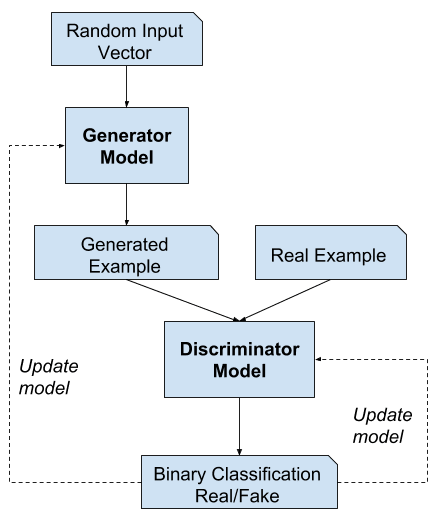
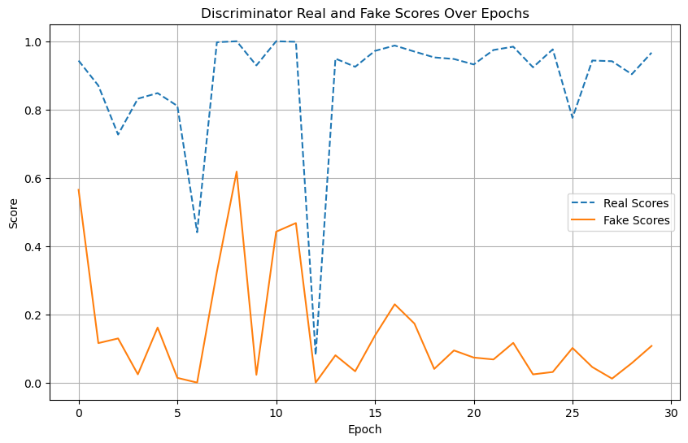

# Generative Adversarial Networks (GANs)

# Introduction to Generative Modeling

Deep neural networks are used mainly for supervised learning: classification or regression. Generative Adversarial Networks or GANs, however, use neural networks for a very different purpose: Generative modeling

> Generative modeling is an unsupervised learning task in machine learning that involves automatically discovering and learning the regularities or patterns in input data in such a way that the model can be used to generate or output new examples that plausibly could have been drawn from the original dataset. - [Source](https://machinelearningmastery.com/what-are-generative-adversarial-networks-gans/)

While there are many approaches used for generative modeling, a Generative Adversarial Network takes the following approach: 



There are two neural networks: a *Generator* and a *Discriminator*. The generator generates a "fake" sample given a random vector/matrix, and the discriminator attempts to detect whether a given sample is "real" (picked from the training data) or "fake" (generated by the generator). Training happens in tandem: train the discriminator for a few epochs, then train the generator for a few epochs, and repeat. This way both the generator and the discriminator get better at doing their jobs. 

GANs however, can be notoriously difficult to train, and are extremely sensitive to hyperparameters, activation functions and regularization. In this tutorial, we'll train a GAN to generate images of anime characters' faces.


Use the [Anime Face Dataset](https://github.com/Mckinsey666/Anime-Face-Dataset), which consists of over 63,000 cropped anime faces. Note that generative modeling is an unsupervised learning task, so the images do not have any labels. Most of the code in this tutorial is based [on this notebook](https://www.kaggle.com/splcher/starter-anime-face-dataset). 

## Exploring the Data

The dataset has a single folder called `images` which contains all 63,000+ images in JPG format.


```python
import os
DATA_DIR = './animefacedataset'
print(os.listdir(DATA_DIR))
```

    ['images']


```python
import os
print(os.getcwd())

```

    /home/lab-user


```python
print(os.listdir(DATA_DIR+'/images')[:10])
```

    ['14020_2006.jpg', '13333_2005.jpg', '60934_2018.jpg', '49439_2015.jpg', '45935_2014.jpg', '48835_2014.jpg', '24253_2008.jpg', '54760_2016.jpg', '7697_2004.jpg', '54228_2016.jpg']


Let's load this dataset using the `ImageFolder` class from `torchvision`. Resize and crop the images to 64x64 px, and normalize the pixel values with a mean & standard deviation of 0.5 for each channel. This will ensure that pixel values are in the range `(-1, 1)`, which is more  convenient for training the discriminator. We will also create a data loader to load the data in batches.


```python
from torch.utils.data import DataLoader
from torchvision.datasets import ImageFolder
import torchvision.transforms as T
```


```python
image_size = 64
batch_size = 128
stats = (0.5, 0.5, 0.5), (0.5, 0.5, 0.5)
```


```python
train_ds = ImageFolder(DATA_DIR, transform=T.Compose([
    T.Resize(image_size),
    T.CenterCrop(image_size),
    T.ToTensor(),
    T.Normalize(*stats)]))

train_dl = DataLoader(train_ds, batch_size, shuffle=True, num_workers=3, pin_memory=True)
```

Let's create helper functions to denormalize the image tensors and display some sample images from a training batch.


```python
import torch
from torchvision.utils import make_grid
import matplotlib.pyplot as plt
%matplotlib inline
```


```python
#image = ((image * std) + mean) --> transform image back in [0 1] range
def denorm(img_tensors):
    return img_tensors * stats[1][0] + stats[0][0]
```


```python
def show_images(images, nmax=64):
    fig, ax = plt.subplots(figsize=(8, 8))
    ax.set_xticks([]); ax.set_yticks([])
    ax.imshow(make_grid(denorm(images.detach()[:nmax]), nrow=8).permute(1, 2, 0))

def show_batch(dl, nmax=64):
    for images, _ in dl:
        show_images(images, nmax)
        break
```


```python
show_batch(train_dl)
```


    

    


## Using a GPU

To seamlessly use a GPU, if one is available, use a couple of helper functions (`get_default_device` & `to_device`) and a helper class `DeviceDataLoader` to move model & data to the GPU, if one is available.


```python
def get_default_device():
    """Pick GPU if available, else CPU"""
    if torch.cuda.is_available():
        return torch.device('cuda')
    else:
        return torch.device('cpu')
    
def to_device(data, device):
    """Move tensor(s) to chosen device"""
    if isinstance(data, (list,tuple)):
        return [to_device(x, device) for x in data]
    return data.to(device, non_blocking=True)

class DeviceDataLoader():
    """Wrap a dataloader to move data to a device"""
    def __init__(self, dl, device):
        self.dl = dl
        self.device = device
        
    def __iter__(self):
        """Yield a batch of data after moving it to device"""
        for b in self.dl: 
            yield to_device(b, self.device)

    def __len__(self):
        """Number of batches"""
        return len(self.dl)
```

Based on where you're running this notebook, your default device could be a CPU (`torch.device('cpu')`) or a GPU (`torch.device('cuda')`).


```python
device = get_default_device()
device
```


    device(type='cuda')


We can now move our training data loader using `DeviceDataLoader` for automatically transferring batches of data to the GPU (if available).


```python
train_dl = DeviceDataLoader(train_dl, device)
```

## Discriminator Network

The discriminator takes an image as input, and tries to classify it as "real" or "generated". In this sense, it's like any other neural network. Use a convolutional neural networks (CNN) which outputs a single number output for every image. Use a stride of 2 to progressively reduce the size of the output feature map.


```python
import torch.nn as nn
```


```python
discriminator = nn.Sequential(
    # in: 3 x 64 x 64
    nn.Conv2d(3, 64, kernel_size=4, stride=2, padding=1, bias=False),
    nn.BatchNorm2d(64),
    nn.LeakyReLU(0.2, inplace=True),
    # out: 64 x 32 x 32

    # in: 64 x 32 x 32
     #add appropriate NN layers (conv2d, batch norm and leaky relu)
    nn.Conv2d(64,128,kernel_size=4,stride=2,padding=1,bias=False),
    nn.BatchNorm2d(128),
    nn.LeakyReLU(0.2,inplace=True),
    # out: 128 x 16 x 16

    # in: 128 x 16 x 16
    nn.Conv2d(128,256,kernel_size=4,stride=2,padding=1,bias=False),
    nn.BatchNorm2d(256),
    nn.LeakyReLU(0.2,inplace=True),
    # out: 256 x 8 x 8

    # in: 256 x 8 x 8
    nn.Conv2d(256,512,kernel_size=4,stride=2,padding=1,bias=False),
    nn.BatchNorm2d(512),
    nn.LeakyReLU(0.2,inplace=True),
    # out: 512 x 4 x 4

    #Add only conv2d layer here to output 1x1x1 value
    nn.Conv2d(512,1,kernel_size=4,stride=1, padding=0,bias=False),
    # out: 1 x 1 x 1

    nn.Flatten(),
    nn.Sigmoid())
```

Note that we're using the Leaky ReLU activation for the discriminator.


>  Different from the regular ReLU function, Leaky ReLU allows the pass of a small gradient signal for negative values. As a result, it makes the gradients from the discriminator flows stronger into the generator. Instead of passing a gradient (slope) of 0 in the back-prop pass, it passes a small negative gradient.  - [Source](https://sthalles.github.io/advanced_gans/)

Just like any other binary classification model, the output of the discriminator is a single number between 0 and 1, which can be interpreted as the probability of the input image being real i.e. picked from the original dataset.

Let's move the discriminator model to the chosen device.


```python
discriminator = to_device(discriminator, device)
```

## Generator Network

The input to the generator is typically a vector or a matrix of random numbers (referred to as a latent tensor) which is used as a seed for generating an image. The generator will convert a latent tensor of shape `(128, 1, 1)` into an image tensor of shape `3 x 28 x 28`. To achive this, we'll use the `ConvTranspose2d` layer from PyTorch, which is performs to as a *transposed convolution* (also referred to as a *deconvolution*). [Learn more](https://github.com/vdumoulin/conv_arithmetic/blob/master/README.md#transposed-convolution-animations)


```python
latent_size = 128
```


```python
generator = nn.Sequential(
    # in: latent_size x 1 x 1

    nn.ConvTranspose2d(latent_size, 512, kernel_size=4, stride=1, padding=0, bias=False),
    nn.BatchNorm2d(512),
    nn.ReLU(True),
    # out: 512 x 4 x 4

    nn.ConvTranspose2d(512, 256,kernel_size=4, stride=2, padding=1, bias=False),
    nn.BatchNorm2d(256),
    nn.ReLU(True),
    # out: 256 x 8 x 8

    nn.ConvTranspose2d(256,128, kernel_size=4, stride=2, padding=1, bias=False),
    nn.BatchNorm2d(128),
    nn.ReLU(True),
    # out: 128 x 16 x 16

    nn.ConvTranspose2d(128, 64,kernel_size=4, stride=2, padding=1, bias=False),
    nn.BatchNorm2d(64),
    nn.ReLU(True),
    # out: 64 x 32 x 32

    nn.ConvTranspose2d(64, 3, kernel_size=4, stride=2, padding=1, bias=False),
    nn.Tanh()
    # out: 3 x 64 x 64
)
```

We use the TanH activation function for the output layer of the generator.


> "The ReLU activation (Nair & Hinton, 2010) is used in the generator with the exception of the output layer which uses the Tanh function. We observed that using a bounded activation allowed the model to learn more quickly to saturate and cover the color space of the training distribution. Within the discriminator we found the leaky rectified activation (Maas et al., 2013) (Xu et al., 2015) to work well, especially for higher resolution modeling." - [Source](https://stackoverflow.com/questions/41489907/generative-adversarial-networks-tanh)


Note that since the outputs of the TanH activation lie in the range `[-1,1]`, we have applied the similar transformation to the images in the training dataset. Let's generate some outputs using the generator and view them as images by transforming and denormalizing the output.


```python
xb = torch.randn(batch_size, latent_size, 1, 1) # random latent tensors
fake_images = generator(xb)
print(fake_images.shape)
show_images(fake_images)
```

    torch.Size([128, 3, 64, 64])


    

    


As one might expect, the output from the generator is basically random noise, since we haven't trained it yet. 

Let's move the generator to the chosen device.


```python
generator = to_device(generator, device)
```

## Discriminator Training

Since the discriminator is a binary classification model, we can use the binary cross entropy loss function to quantify how well it is able to differentiate between real and generated images.


```python
import torch.nn.functional as F
def train_discriminator(real_images, opt_d):
    # Clear discriminator gradients
    opt_d.zero_grad()

    # Pass real images through discriminator
    real_preds = discriminator(real_images)
    real_targets = torch.ones(real_images.size(0), 1, device=device)
    real_loss = F.binary_cross_entropy(real_preds, real_targets)
    real_score = torch.mean(real_preds).item()
    
    # Generate fake images
    latent = torch.randn(batch_size, latent_size, 1, 1, device=device)
    fake_images = generator(latent)
    #latent = torch.randn(batch_size, latent_size, 1, 1, device=device)
    
    #fake_images = generator(latent)

    # Pass fake images through discriminator
    fake_preds = discriminator(fake_images.detach())  # Detach to avoid backprop to generator
    fake_targets = torch.zeros(fake_images.size(0), 1, device=device)
    fake_loss = F.binary_cross_entropy(fake_preds, fake_targets)
    fake_score = torch.mean(fake_preds).item()

    # Update discriminator weights
    loss = real_loss + fake_loss
    loss.backward()
    opt_d.step()
    return loss.item(), real_score, fake_score
```

Here are the steps involved in training the discriminator.

- We expect the discriminator to output 1 if the image was picked from the real Anime dataset, and 0 if it was generated using the generator network. 

- We first pass a batch of real images, and compute the loss, setting the target labels to 1. 

- Then we pass a batch of fake images (generated using the generator) pass them into the discriminator, and compute the loss, setting the target labels to 0. 

- Finally we add the two losses and use the overall loss to perform gradient descent to adjust the weights of the discriminator.

It's important to note that we don't change the weights of the generator model while training the discriminator (`opt_d` only affects the `discriminator.parameters()`)

## Generator Training

Since the outputs of the generator are images, it's not obvious how we can train the generator. This is where we employ a rather elegant trick, which is to use the discriminator as a part of the loss function. Here's how it works:

- We generate a batch of images using the generator, pass the into the discriminator.

- We calculate the loss by setting the target labels to 1 i.e. real. We do this because the generator's objective is to "fool" the discriminator. 

- We use the loss to perform gradient descent i.e. change the weights of the generator, so it gets better at generating real-like images to "fool" the discriminator.

Here's what this looks like in code.


```python
def train_generator(opt_g):
    # Clear generator gradients
    opt_g.zero_grad()
    
    # Generate fake images
    latent = torch.randn(batch_size, latent_size, 1, 1, device=device)
    fake_images = generator(latent)
    
    # Try to fool the discriminator
    preds = discriminator(fake_images)
    targets = torch.ones(batch_size, 1, device=device)
    loss = F.binary_cross_entropy(preds, targets)
    
    # Update generator weights
    loss.backward()
    opt_g.step()
    
    return loss.item()
```

Let's create a directory where we can save intermediate outputs from the generator to visually inspect the progress of the model. We'll also create a helper function to export the generated images.


```python
from torchvision.utils import save_image
```


```python
sample_dir = 'generated'
os.makedirs(sample_dir, exist_ok=True)
```


```python
def save_samples(index, latent_tensors, show=True):
    fake_images = generator(latent_tensors)
    fake_fname = 'generated-images-{0:0=4d}.png'.format(index)
    save_image(denorm(fake_images), os.path.join(sample_dir, fake_fname), nrow=8)
    print('Saving', fake_fname)
    if show:
        fig, ax = plt.subplots(figsize=(8, 8))
        ax.set_xticks([]); ax.set_yticks([])
        ax.imshow(make_grid(fake_images.cpu().detach(), nrow=8).permute(1, 2, 0))
```

We'll use a fixed set of input vectors to the generator to see how the individual generated images evolve over time as we train the model. Let's save one set of images before we start training our model.


```python
fixed_latent = torch.randn(64, latent_size, 1, 1, device=device)
```


```python
import torch
torch.cuda.empty_cache()
```


```python
save_samples(0, fixed_latent)
```

    Clipping input data to the valid range for imshow with RGB data ([0..1] for floats or [0..255] for integers). Got range [-0.99972016..0.9999856].


    Saving generated-images-0000.png


    

    


## Full Training Loop

Let's define a `fit` function to train the discriminator and generator in tandem for each batch of training data. We'll use the Adam optimizer with some custom parameters (betas) that are known to work well for GANs. We will also save some sample generated images at regular intervals for inspection.


```python
from tqdm.notebook import tqdm
import torch.nn.functional as F
```


```python
def fit(epochs, lr, start_idx=1):
    torch.cuda.empty_cache()
    
    # Losses & scores
    losses_g = []
    losses_d = []
    real_scores = []
    fake_scores = []
    loss_gen_val = 0
    loss_disr_val = 0
    
    # Create optimizers
    opt_d = torch.optim.Adam(discriminator.parameters(), lr=lr, betas=(0.5, 0.999))
    opt_g = torch.optim.Adam(generator.parameters(), lr=lr, betas=(0.5, 0.999))
    
    for epoch in range(epochs):
        for real_images, _ in tqdm(train_dl):
            # Train discriminator
            loss_d,real_score,false_score=train_discriminator(real_images,opt_d)
            # Train generator
            loss_g = train_generator(opt_g)

            
            
        # Record losses & scores
        losses_g.append(loss_g)
        losses_d.append(loss_d)
        real_scores.append(real_score)
        fake_scores.append(false_score)
        
        
        # Log losses & scores (last batch)
        print("Epoch [{}/{}], loss_g: {:.4f}, loss_d: {:.4f}, real_score: {:.4f}, fake_score: {:.4f}".format(
            epoch+1, epochs, loss_g, loss_d, real_score, false_score))
    
        # Save generated images
        save_samples(epoch+start_idx, fixed_latent, show=False)
    
    return losses_g, losses_d, real_scores, fake_scores
```

We are now ready to train the model. Try different learning rates to see if you can maintain the fine balance between the training the generator and the discriminator.


```python
lr = 0.0002
epochs = 30
```


```python
history = fit(epochs, lr)
```


      0%|          | 0/497 [00:00<?, ?it/s]


    Epoch [1/30], loss_g: 9.5116, loss_d: 0.9687, real_score: 0.9431, fake_score: 0.5647
    Saving generated-images-0001.png


      0%|          | 0/497 [00:00<?, ?it/s]


    Epoch [2/30], loss_g: 3.6080, loss_d: 0.3066, real_score: 0.8700, fake_score: 0.1158
    Saving generated-images-0002.png


      0%|          | 0/497 [00:00<?, ?it/s]


    Epoch [3/30], loss_g: 4.0246, loss_d: 0.5249, real_score: 0.7265, fake_score: 0.1294
    Saving generated-images-0003.png


      0%|          | 0/497 [00:00<?, ?it/s]


    Epoch [4/30], loss_g: 3.7707, loss_d: 0.2437, real_score: 0.8316, fake_score: 0.0243
    Saving generated-images-0004.png


      0%|          | 0/497 [00:00<?, ?it/s]


    Epoch [5/30], loss_g: 5.2498, loss_d: 0.4012, real_score: 0.8479, fake_score: 0.1613
    Saving generated-images-0005.png


      0%|          | 0/497 [00:00<?, ?it/s]


    Epoch [6/30], loss_g: 4.7650, loss_d: 0.2701, real_score: 0.8104, fake_score: 0.0140
    Saving generated-images-0006.png


      0%|          | 0/497 [00:00<?, ?it/s]


    Epoch [7/30], loss_g: 8.2122, loss_d: 1.1243, real_score: 0.4404, fake_score: 0.0002
    Saving generated-images-0007.png


      0%|          | 0/497 [00:00<?, ?it/s]


    Epoch [8/30], loss_g: 10.8391, loss_d: 0.5436, real_score: 0.9969, fake_score: 0.3245
    Saving generated-images-0008.png


      0%|          | 0/497 [00:00<?, ?it/s]


    Epoch [9/30], loss_g: 14.4996, loss_d: 1.4605, real_score: 0.9998, fake_score: 0.6180
    Saving generated-images-0009.png


      0%|          | 0/497 [00:00<?, ?it/s]


    Epoch [10/30], loss_g: 5.4471, loss_d: 0.1057, real_score: 0.9290, fake_score: 0.0231
    Saving generated-images-0010.png


      0%|          | 0/497 [00:00<?, ?it/s]


    Epoch [11/30], loss_g: 9.8494, loss_d: 0.7731, real_score: 0.9998, fake_score: 0.4421
    Saving generated-images-0011.png


      0%|          | 0/497 [00:00<?, ?it/s]


    Epoch [12/30], loss_g: 11.1904, loss_d: 0.7822, real_score: 0.9982, fake_score: 0.4673
    Saving generated-images-0012.png


      0%|          | 0/497 [00:00<?, ?it/s]


    Epoch [13/30], loss_g: 1.9325, loss_d: 3.5649, real_score: 0.0809, fake_score: 0.0000
    Saving generated-images-0013.png


      0%|          | 0/497 [00:00<?, ?it/s]


    Epoch [14/30], loss_g: 4.1018, loss_d: 0.1482, real_score: 0.9489, fake_score: 0.0802
    Saving generated-images-0014.png


      0%|          | 0/497 [00:00<?, ?it/s]


    Epoch [15/30], loss_g: 4.1754, loss_d: 0.1186, real_score: 0.9250, fake_score: 0.0332
    Saving generated-images-0015.png


      0%|          | 0/497 [00:00<?, ?it/s]


    Epoch [16/30], loss_g: 5.8300, loss_d: 0.1935, real_score: 0.9715, fake_score: 0.1377
    Saving generated-images-0016.png


      0%|          | 0/497 [00:00<?, ?it/s]


    Epoch [17/30], loss_g: 8.0138, loss_d: 0.3409, real_score: 0.9872, fake_score: 0.2295
    Saving generated-images-0017.png


      0%|          | 0/497 [00:00<?, ?it/s]


    Epoch [18/30], loss_g: 1.1864, loss_d: 0.2579, real_score: 0.9695, fake_score: 0.1729
    Saving generated-images-0018.png


      0%|          | 0/497 [00:00<?, ?it/s]


    Epoch [19/30], loss_g: 4.1291, loss_d: 0.0965, real_score: 0.9525, fake_score: 0.0402
    Saving generated-images-0019.png


      0%|          | 0/497 [00:00<?, ?it/s]


    Epoch [20/30], loss_g: 4.0435, loss_d: 0.1639, real_score: 0.9478, fake_score: 0.0943
    Saving generated-images-0020.png


      0%|          | 0/497 [00:00<?, ?it/s]


    Epoch [21/30], loss_g: 4.3379, loss_d: 0.1558, real_score: 0.9318, fake_score: 0.0735
    Saving generated-images-0021.png


      0%|          | 0/497 [00:00<?, ?it/s]


    Epoch [22/30], loss_g: 5.2795, loss_d: 0.1059, real_score: 0.9742, fake_score: 0.0679
    Saving generated-images-0022.png


      0%|          | 0/497 [00:00<?, ?it/s]


    Epoch [23/30], loss_g: 1.8832, loss_d: 0.1975, real_score: 0.9839, fake_score: 0.1165
    Saving generated-images-0023.png


      0%|          | 0/497 [00:00<?, ?it/s]


    Epoch [24/30], loss_g: 4.7856, loss_d: 0.1174, real_score: 0.9235, fake_score: 0.0242
    Saving generated-images-0024.png


      0%|          | 0/497 [00:00<?, ?it/s]


    Epoch [25/30], loss_g: 6.1682, loss_d: 0.0581, real_score: 0.9761, fake_score: 0.0312
    Saving generated-images-0025.png


      0%|          | 0/497 [00:00<?, ?it/s]


    Epoch [26/30], loss_g: 3.8805, loss_d: 0.4707, real_score: 0.7754, fake_score: 0.1015
    Saving generated-images-0026.png


      0%|          | 0/497 [00:00<?, ?it/s]


    Epoch [27/30], loss_g: 3.9909, loss_d: 0.1128, real_score: 0.9434, fake_score: 0.0456
    Saving generated-images-0027.png


      0%|          | 0/497 [00:00<?, ?it/s]


    Epoch [28/30], loss_g: 6.1088, loss_d: 0.0772, real_score: 0.9413, fake_score: 0.0118
    Saving generated-images-0028.png


      0%|          | 0/497 [00:00<?, ?it/s]


    Epoch [29/30], loss_g: 3.2666, loss_d: 0.1777, real_score: 0.9032, fake_score: 0.0572
    Saving generated-images-0029.png


      0%|          | 0/497 [00:00<?, ?it/s]


    Epoch [30/30], loss_g: 5.3882, loss_d: 0.1633, real_score: 0.9662, fake_score: 0.1075
    Saving generated-images-0030.png


```python
losses_g, losses_d, real_scores, fake_scores = history
```

Now that we have trained the models, we can save checkpoints.


```python
# Save the model checkpoints 
torch.save(generator.state_dict(), 'G.pth')
torch.save(discriminator.state_dict(), 'D.pth')
```

Here's how the generated images look, after the 1st, 5th and 10th epochs of training.


```python
from IPython.display import Image
```


```python
Image('./generated/generated-images-0001.png')
```


    

    


```python
Image('./generated/generated-images-0005.png')
```


    

    


```python
Image('./generated/generated-images-0010.png')
```


    

    


```python
Image('./generated/generated-images-0020.png')
```


    

    


```python
Image('./generated/generated-images-0025.png')
```


    

    


Visualize how the loss changes over time. Visualizing 
losses is quite useful for debugging the training process. For GANs, we expect the generator's loss to reduce over time, without the discriminator's loss getting too high.


```python
#Plot Loss of Generator and Discriminator
plt.figure(figsize=(10, 6))
plt.plot(losses_g, label='Generator Loss', linestyle='--')
plt.plot(losses_d, label='Discriminator Loss', linestyle='-')
plt.title("Generator and Discriminator Loss Over Epochs")
plt.xlabel("Epoch")
plt.ylabel("Loss")
plt.legend()
plt.grid(True)
plt.show()
```


    

    


```python
#Plot Real and Fake scores
plt.figure(figsize=(10, 6))
plt.plot(real_scores, label='Real Scores', linestyle='--')
plt.plot(fake_scores, label='Fake Scores', linestyle='-')
plt.title("Discriminator Real and Fake Scores Over Epochs")
plt.xlabel("Epoch")
plt.ylabel("Score")
plt.legend()
plt.grid(True)
plt.show()
```


    

    

